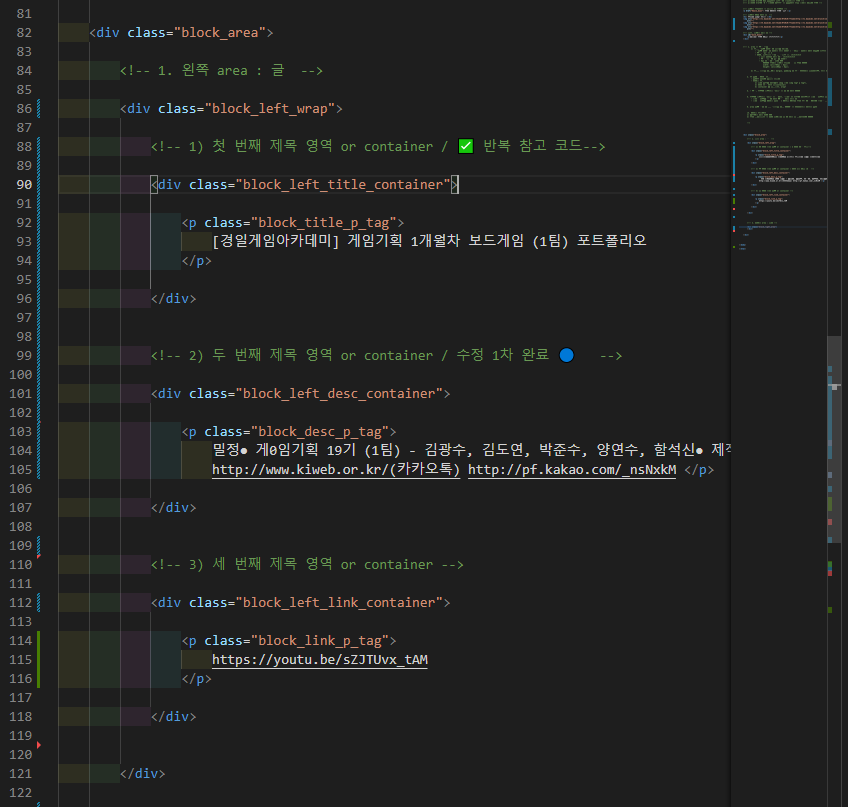

## 느낀것들

- 별도의 디자인이 필요한지 여부 -> 별도의 class 부여 결정 

 

- 목차를 짜고 -> 반복되는 부분을 하나 완성했으면 -> 복붙해서 수정

 

- 무엇을 반복해야 하는지 ✅ 체크 
- 지금 어디를 수정중 인지 체크 ▶ 
- 완료 🔵 
- 뭔가 이상 🟧 
- 에러 발생 📛 혹은 🟥 

## class 위계 체계 ⭐⭐⭐⭐⭐ 

1. area : 기초 영역

    1) container 들이 여러개 있는 wrap
        

            ㄱ) container : 글(p태그로 표현), 이미지(img 태그로 표현) 를 담고 있는 div 
                

                

                A) img 태그(P태그) : 글자가 그냥 담길 수는 없음. 어딘가에 담길텐데. 그곳
                    

⭐⭐⭐⭐⭐ 
- 
- 자, 이 위계를 기초로, 하나 하나 기능을 추가하면서 만들어보자 ⭐⭐⭐⭐⭐ 
- 과연, tag 레벨에서 먹일 것들을 정리해두고, 다른 디자인들을 찾고 정리하고. ⭐⭐⭐⭐⭐ 
- 노션을 좀 더 제대로 공부하면 도움이 많이 될 것 같다 ⭐⭐⭐⭐⭐ 

## class 판단 

모두 글자를 넣네? -> 스타일이 같아? -> 같으면 동일 class 
스타일리 달라? -> 다르면 다른 class 

제목, 설명, footer 처럼, 위치가 달라? -> 그래도, 디자인이 같으면, 동일 class 

⭐⭐⭐ 어떤 위치냐! 가 아니라, 디자인이 비슷한지 여부 로 결정해야 하지 않을까. 

디자인이 다르니까 -> class 달라야 하고 -> 이름을 지을 때, 위치 및 역할을 반영해서 짓는 것 ⭐⭐⭐ 

## img 태그 (태그 태그) / img 태그의 container 태그
/* img tag 부모인 img_container 라면, img_container 를 class 로 만들어도 된다. ⭐⭐⭐⭐⭐ */
.block_right_image_container {
    width: 250px;
    height: 106px;
}

/* ⭐⭐⭐ tag 에 있는 거면, img 에 걸어도 된다. ⭐⭐⭐ */
.block_image_img_tag {
    width: 100%;
    height: 100%;

    /* 원본 사진이 crop 되어서 나오는 느낌 */
    object-fit: cover;

}

--- 

## 영역 배치 > 콘텐츠 배치
1. 영역 배치 
영역 배치는 area 랑 container 랑 관계를 연결 

  

2. 콘텐츠 배치 
실제로 글, 그림을 내가 원하는 곳으로 배치 
container 끼리 배치가 되었으면, container 와 img 혹은 p 태그랑 배치를 시키면 됨. 

1) 그러려면, 필요한 것
- container 의 크기(width, height)
    - 빼기 기능을 쓰면, '매번, 개발자 도구 확인 안 하고, 바로 할 수 있을거 같기도 한데?
    -   `width: calc(708px + 100px);
        height: calc(108px - 6px);

    - 혹시 특정 값을 가져오는 기능은 없나❓❓❓❓❓ 
        - block_area width, heigth 값을 담아 두면 > container 에서 편하게 변경할 수 있을거 같은데 

- container 에 display flex 와 친구들 
ex) /* 가운데로 정렬 시키기 */
display: flex;
flex-direction: column;
align-items: center;